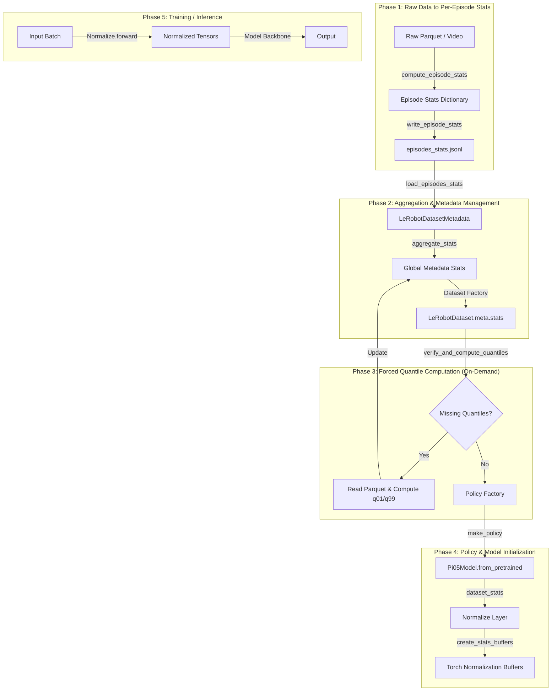

# Dataset Statistics Data Flow Analysis

This document traces the flow of `dataset_stats` from raw data input to its final adoption by the policy's normalization layers.

## Data Flow Diagram



## Detailed Flow Breakdown

### 1. Source Data Input
- **Parquet Files**: Store numerical data (joint states, actions, timestamps).
- **Video/Images**: Store visual observations.

### 2. Computing Episode Stats ([compute_stats.py](file:///d:/Downloads/OpenTau-main%20%286%29/OpenTau-main/tests/datasets/test_compute_stats.py))
- [compute_episode_stats](file:///d:/Downloads/OpenTau-main%20%286%29/OpenTau-main/src/opentau/datasets/compute_stats.py#200-265) is the entry point for calculating statistics for a single episode.
- It samples images/videos and processes numerical vectors.
- **Quantiles**: Now strictly computed only for [state](file:///d:/Downloads/OpenTau-main%20%286%29/OpenTau-main/src/opentau/configs/policies.py#179-190) and [actions](file:///d:/Downloads/OpenTau-main%20%286%29/OpenTau-main/src/opentau/policies/pi05/modeling_pi05.py#551-619) features via [get_feature_stats](file:///d:/Downloads/OpenTau-main%20%286%29/OpenTau-main/src/opentau/datasets/compute_stats.py#175-198).

### 3. Aggregation ([lerobot_dataset.py](file:///d:/Downloads/OpenTau-main%20%286%29/OpenTau-main/src/opentau/datasets/lerobot_dataset.py))
- `LeRobotDatasetMetadata.load_metadata` reads all per-episode stats from `meta/episodes_stats.jsonl`.
- [aggregate_stats](file:///d:/Downloads/OpenTau-main%20%286%29/OpenTau-main/src/opentau/datasets/compute_stats.py#359-383) performs a weighted combination (using counts/lengths) of these stats to produce the global `dataset_stats`.

### 4. Training Integration ([train.py](file:///d:/Downloads/OpenTau-main%20%286%29/OpenTau-main/src/opentau/scripts/train.py))
- Immediately after [make_dataset_mixture](file:///d:/Downloads/OpenTau-main%20%286%29/OpenTau-main/src/opentau/datasets/factory.py#231-265), the [verify_and_compute_quantiles](file:///d:/Downloads/OpenTau-main%20%286%29/OpenTau-main/src/opentau/datasets/lerobot_dataset.py#1861-1953) method is called.
- This ensures that if the policy requires `QUANTILE` normalization but the statistics are missing (e.g., from an older dataset), they are computed and persisted before the policy is even created.

### 5. Policy Loading ([factory.py](file:///d:/Downloads/OpenTau-main%20%286%29/OpenTau-main/src/opentau/datasets/factory.py) & [modeling_pi05.py](file:///d:/Downloads/OpenTau-main%20%286%29/OpenTau-main/src/opentau/policies/pi05/modeling_pi05.py))
- `make_policy` takes the `ds_meta.stats` and passes it as `dataset_stats` to the model.
- Inside `ModelingPi05`, the `dataset_stats` is used to instantiate the [Normalize](file:///d:/Downloads/OpenTau-main%20%286%29/OpenTau-main/src/opentau/policies/normalize.py#177-262) class:
  ```python
  self.normalize_inputs = Normalize(config.input_features, config.normalization_mapping, dataset_stats)
  ```
- The [Normalize](file:///d:/Downloads/OpenTau-main%20%286%29/OpenTau-main/src/opentau/policies/normalize.py#177-262) class (in [normalize.py](file:///d:/Downloads/OpenTau-main%20%286%29/OpenTau-main/src/opentau/policies/normalize.py)) converts these numpy statistics into torch buffers for efficient GPU computations during [forward()](file:///d:/Downloads/OpenTau-main%20%286%29/OpenTau-main/src/opentau/policies/pi0/modeling_pi0.py#408-443).

### 6. Training/Inference Loop
- During every training step, the raw batch is passed through `policy.normalize_inputs.forward(batch)`.
- It uses the aggregated statistics to scale the data according to the chosen [NormalizationMode](file:///d:/Downloads/OpenTau-main%20%286%29/OpenTau-main/src/opentau/configs/types.py#42-53) (MEAN_STD, MIN_MAX, or QUANTILE).
